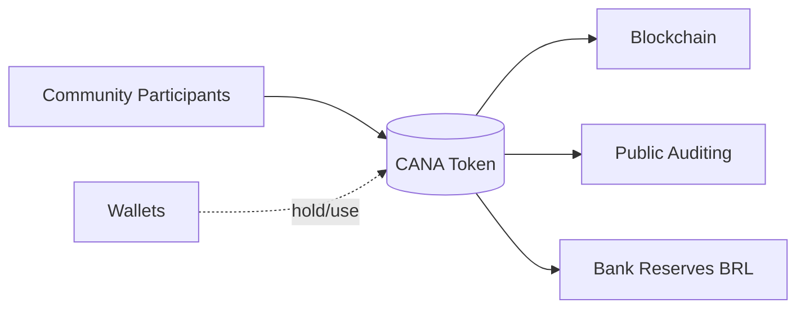
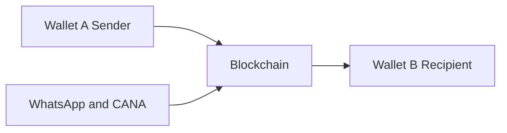

# Onchain Community Currency Monorepo

(A) Community participants mint/redeem (B) Caiana tokens backed by BRL reserves held at (D) the bank. Activity is recorded on the blockchain and can be inspected (C) for transparency. Users hold and use tokens in (E) wallets.

- A: Sender wallet
- B: Recipient wallet
- C: WhatsApp interface and on-chain token actions via the backend
- Blockchain: records token transfers between wallets

This repository contains the code and configuration for Caiana — a community currency system built on Celo — and supporting tooling to launch, operate, and document a bank‑backed, on‑chain local currency.

## What’s Inside

- `frontend/` — Web UI for interacting with the system (if present in your checkout).
- `backend/` — Lightweight backend (Node/Express) with endpoints for auth, admin config, and on-chain utilities.
- `stablecoin/` — Caiana (CANA) stablecoin contracts and tooling (based on Circle’s stablecoin-evm framework). Includes Hardhat/Foundry config, deployment scripts, and docs.
- `communitycurrencylauncher/` — A launcher app to create and manage community currencies, including contracts, backend helpers, and a static frontend.

## Public Links

- Caiana public statement and on‑chain activity (Blockscout):
  https://celo.blockscout.com/address/0x15ffACd88539aFa123AD4707e28f6Bc3A7DBBad7?tab=txs
- Community Currency Launcher (live):
  https://brazil-community-currency.vercel.app/

## Transparency

The amount of Caiana (CANA) minted corresponds to BRL reserves and is evidenced publicly via the Blockscout link above. See `stablecoin/README.md` for details.

## Production UX

In a production setting, people would transact on Web3 with the community currency via WhatsApp or the community’s already established application. The blockchain/Web3 layer is abstracted behind the scenes, so users can send and receive value without needing to know it is Web3.

## Future Improvements

- Paymaster (Pimlico on Celo) for sponsored, free end-user transactions.
- Geofenced boundaries that only allow transactions within the community’s defined area.
- Holder cap: at most 10,000 wallet addresses can hold the community currency.
- Governance interfaces, potentially coordinated through WhatsApp.

### Regulatory Context (Brazil, 2025)

In 2025, under PL 4476/2023 and the CADSOL framework, any organization issuing or managing a community currency (Moeda Social) in Brazil must register as a solidarity economy enterprise through CADSOL, providing founding and governance documents, member lists, and proof of community activity. After receiving the DCSOL certificate, it must obtain MTE/Senaes authorization, submitting its statute, proof of Real-backed reserves (1:1 parity), a territorial and transparency plan, and technology compliance (for blockchain/DLT systems). Renewal every two years and periodic audits ensure reserve integrity and ongoing community participation within Brazil’s solidarity economy system.

## Development Overview

- Prereqs typically include Node.js (LTS), pnpm/yarn/npm, and for contracts Hardhat/Foundry. See subproject READMEs for exact versions and steps.
- Common workflows:
  - Frontend: install, build, and run dev server.
  - Backend: provide `.env` (see examples), then run with Node.
  - Contracts: build/test with Foundry or Hardhat; deploy via provided scripts.

## Security and Secrets

- Do not commit private keys or secrets. Environment files are ignored by `.gitignore` and examples are provided as `.env.example` where applicable.
- If rotating or revoking credentials, update deployment configs and relevant services.

## Repository Structure Notes

- Each subfolder contains its own README and scripts where applicable.
- This repo tracks both application code (UI/API) and on‑chain components for a cohesive, auditable system.
